# Examples

All files were generated with GNU Octave 6.2.0 on Debian 11 using "Dataset Viewer, version 1.0".
All examples are based on the dataset "ts1\_wc040\_d50_6.oct", which is freely available at the following URL: [https://doi.org/10.3217/bhs4g-m3z76](https://doi.org/10.3217/bhs4g-m3z76)


## Directories and files

```
	examples/   
	├── plot2d   
	│   ├── ts1_wc040_d50_6_c288.png   
	│   ├── ts1_wc040_d50_6_cs288_stacked.png   
	│   ├── ts1_wc040_d50_6_multiple_stacked.png   
	│   └── ts1_wc040_d50_6_s288.png   
	├── plot3d   
	│   ├── ts1_wc040_d50_6_c_all.png   
	│   ├── ts1_wc040_d50_6_c_disturbance.png   
	│   ├── ts1_wc040_d50_6_c_noise.png   
	│   ├── ts1_wc040_d50_6_c_soundwave.png   
	│   ├── ts1_wc040_d50_6_s_all.png   
	│   ├── ts1_wc040_d50_6_s_disturbance.png   
	│   ├── ts1_wc040_d50_6_s_noise.png   
	│   └── ts1_wc040_d50_6_s_soundwave.png   
	├── plotmp4   
	│   ├── ts1_wc040_d50_6_c.mp4   
	│   ├── ts1_wc040_d50_6_cs_combined.mp4   
	│   ├── ts1_wc040_d50_6_cs_stacked.mp4   
	│   └── ts1_wc040_d50_6_s.mp4   
	├── plottem   
	│   ├── ts1_wc040_d50_6_tem_t1.png   
	│   ├── ts1_wc040_d50_6_tem_t1-t3.png   
	│   ├── ts1_wc040_d50_6_tem_t1-t4.png   
	│   ├── ts1_wc040_d50_6_tem_t2.png   
	│   ├── ts1_wc040_d50_6_tem_t3.png   
	│   └── ts1_wc040_d50_6_tem_t4.png   
	├── README.html   
	└── README.md   
```

- **plot2d**: 2D plots of ultrasonic signal data   
- **plot3d**: 3D plots of ultrasonic signal data   
- **plotmp4**: MP4 video of ultrasonic signal data   
- **plottem**: 2D plots of specimen temperature measurements   
- README.html: HTML version of this file   
- README.md: this file   


## Licence

All files listed above are licenced under the [Creative Commons Attribution 4.0 International licence](https://creativecommons.org/licenses/by/4.0/).


---
## Preview - MP4 videos

[](https://youtu.be/zL3hvoTZr7w)

[](https://youtu.be/LoEu6EJStJY)

[](https://youtu.be/anilHWu7ubY)

[](https://youtu.be/vOIAmYTX2sM)


---
## Preview - 2D plots

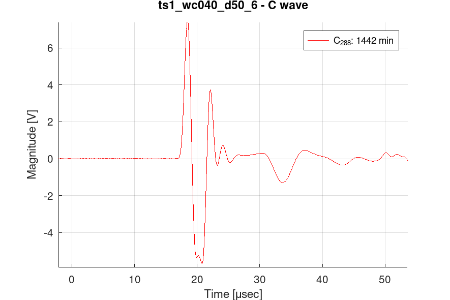

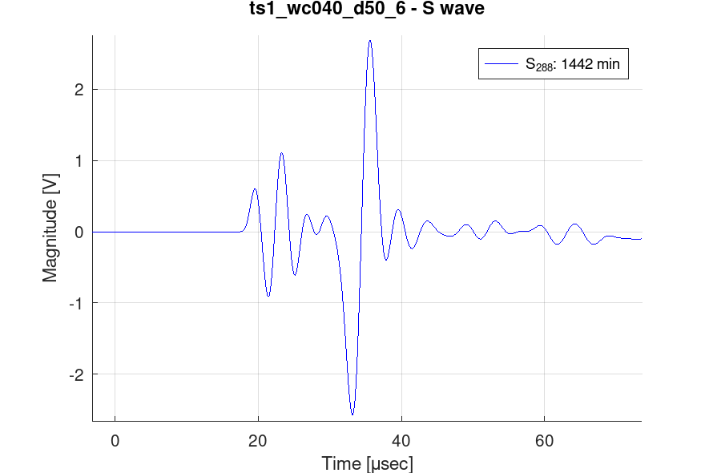

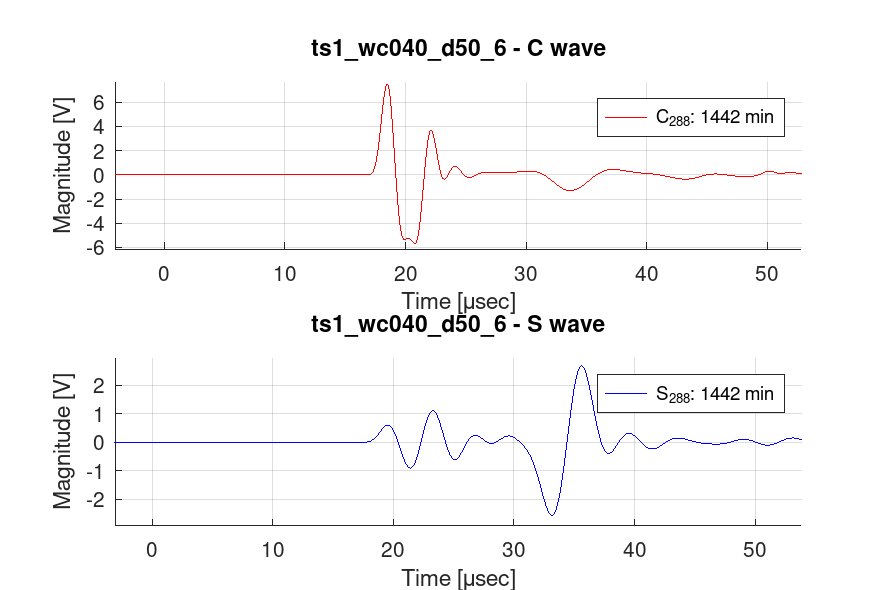

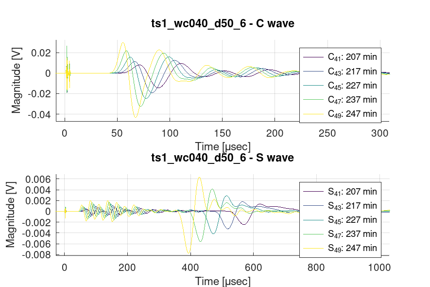


---
## Preview - 3D plots


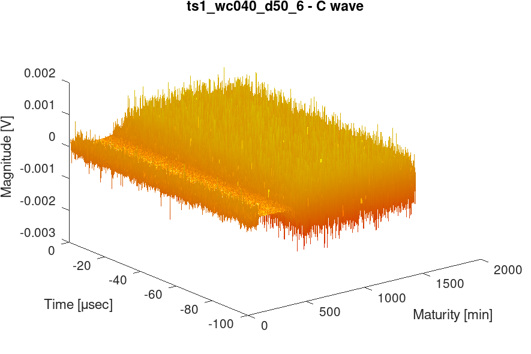

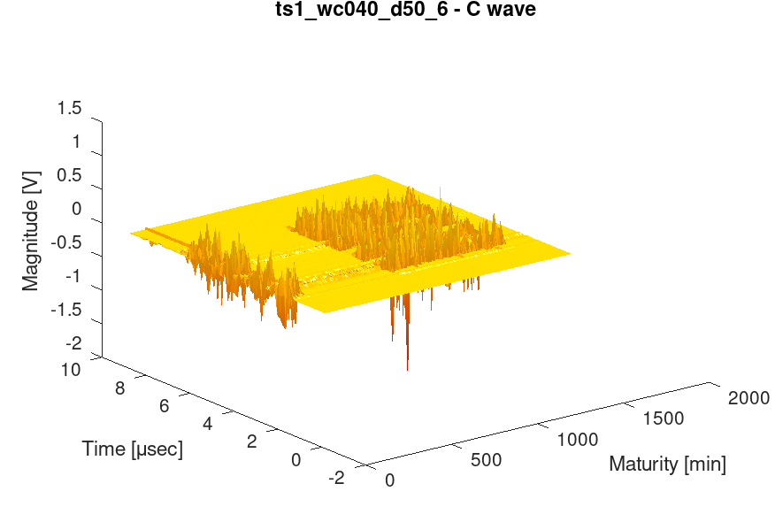

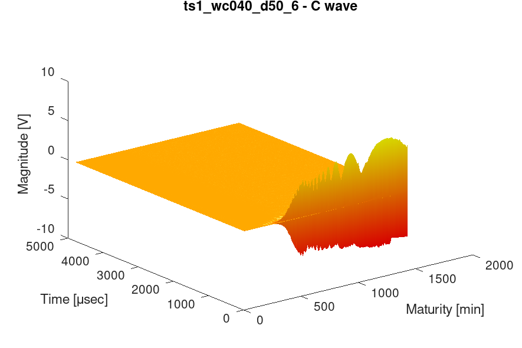

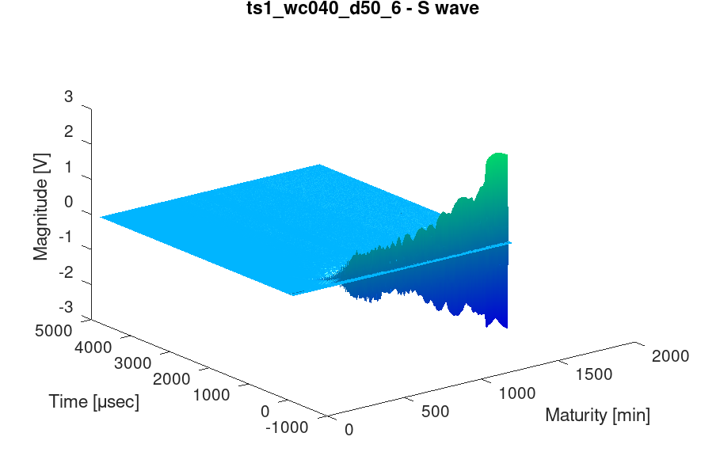


---
## Preview - Temperature plots


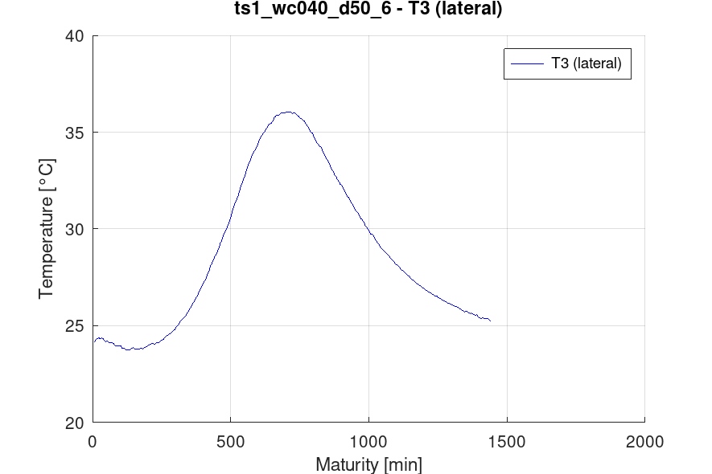

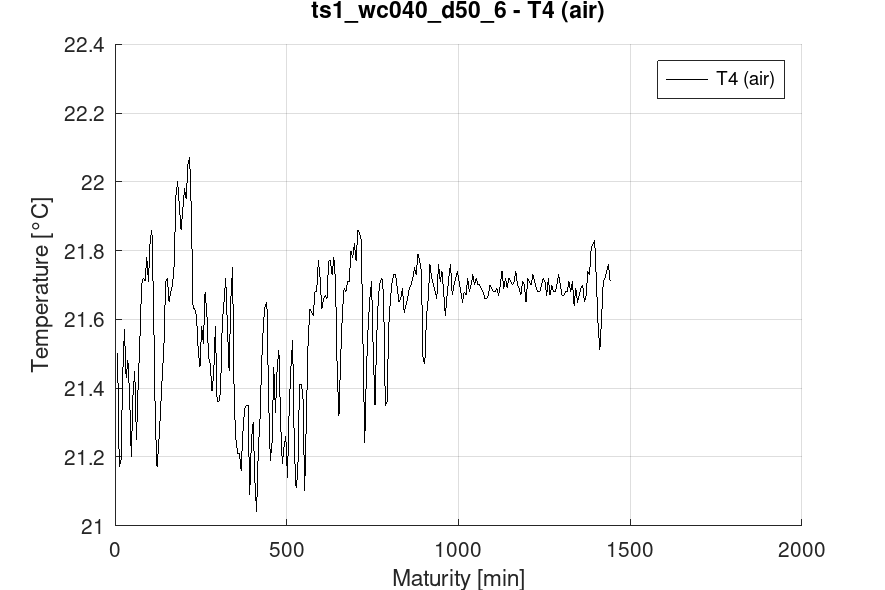

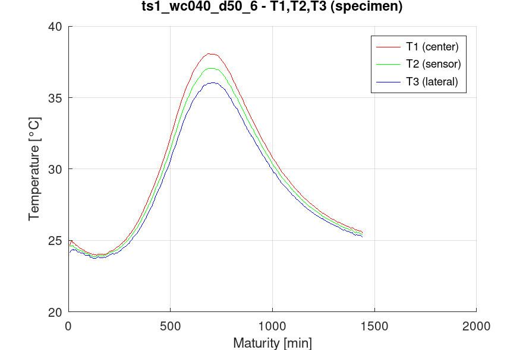

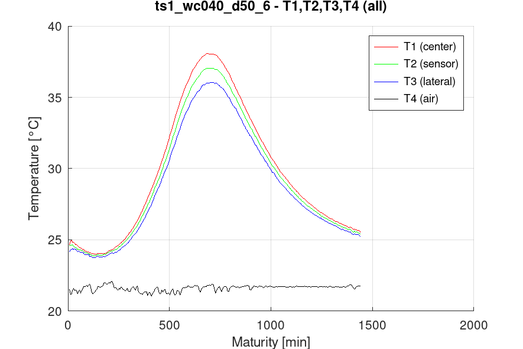

